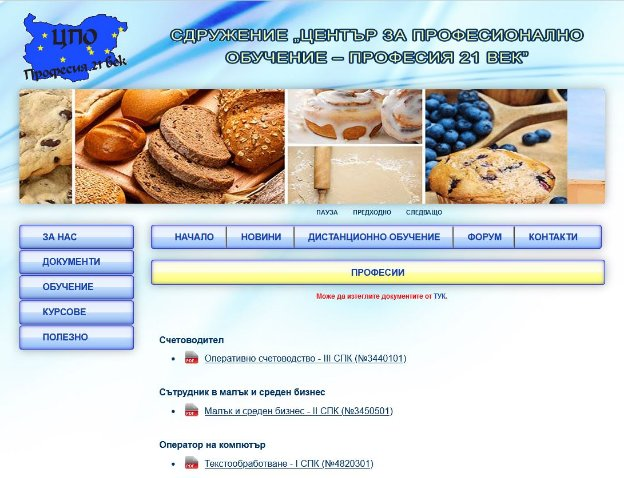

# Graduating-work---Website-creation

*As a student I had interests in HTML, PHP, CSS, MySQL and those interests lead me to graduating work - creation of a website. If you are curious about it you can check all the files inside the folders. The site is writen down based on PHP and CSS and for the admin panel It was used MySQL + PHP*

> ***Sample picture of the website:***

